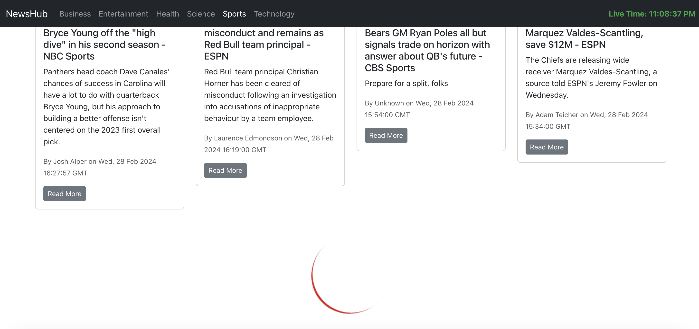

# NewsHub - ReactJS News App

NewsHub is a responsive news application built using ReactJS that leverages the NewsAPI to fetch the latest news updates. The app provides a user-friendly interface with categorized sections for news, allowing users to access news tailored to specific interests such as sports, business, entertainment, health, science, and technology. Each category presents a dedicated page displaying relevant headlines. The application incorporates a live timer feature, ensuring users are informed about the current time, and employs a spinner and top loader to enhance the user experience during data fetching. Additionally, the use of infinite scroll enables seamless navigation through extensive news content.

## Screenshots

### Home Page

### Category Filter

### Spinner and Top Loader

### Infinite Scroll

